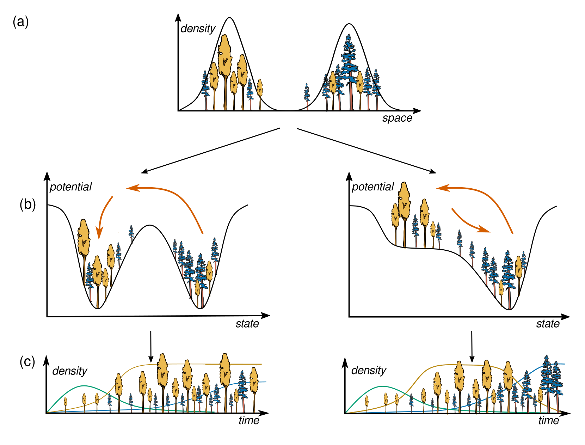

# Disturbances and long-transients give the illusion of alternative stable states

This repository contains code and data needed to reproduce the data analysis and figures of the paper *Disturbances and long-transients give the illusion of alternative stable states* as well as Chapter 3.3 of my thesis.



## Folder structure

├── **code** &#x1F4C1;

│&nbsp; &nbsp; &nbsp; &nbsp;└── numerics &#x1F4C1;  *scripts to perform numerical simulations*

│&nbsp; &nbsp; &nbsp; &nbsp;└── `Introduction_splitting_scheme.ipynb` &#x1F4C1; *An interactive notebook to give a friendly introduction to the splitting scheme*

│&nbsp; &nbsp; &nbsp; &nbsp;└──  `Figure2_potential_estimation.R`&#x1F4C4; *Estimates and plots* $\hat{U}(\chi^C_{\text{BNE}})$ *and* $\hat{U}(X)$ 

│&nbsp; &nbsp; &nbsp; &nbsp;└──  `Figure3_trajectories.R`&#x1F4C4; *Plots trajectories of* $\chi^C_{\text{i}}(t)$ *and* $X(t)$

│&nbsp; &nbsp; &nbsp; &nbsp;└──  `Figure3_trajectories.R`&#x1F4C4; *Plots bifurcation diagrams*

│&nbsp; &nbsp; &nbsp; &nbsp;└──  `lpj_densities.R`&#x1F4C4; *Estimates and plots* $\hat{p}(\chi^C_{\text{BNE}})$ *and* $\hat{p}(\chi^C_{\text{BNE}}, k_{T_G})$ *(only for thesis)*

├── **data** &#x1F4C1;  *Data from numerical simulation needs to be created with the scripts in `data/numerics`*
  
├── **figures** &#x1F4C1; *Contains all the plots of the paper.*

$^*$*See https://github.com/lucialayr/borealRecovery for details on methodology* 

</p>

## Reproducing the analysis


You to create numerical simulations and reproduce the analysis, there are two options

### Option 1: Using Conda Environment 

This will be the fastest and easiest way in most cases. After pulling the repository, run the following to create the Python environment

```bash
conda env create -f environment.yml

conda activate alphastableTransient
```
To recreate data for potential estimation, run 

```bash 
bash code/numerics/simulate_states.sh 10000
```

This parallelizes over 10 cores and runs 100000 realizations in total (10*10000, on my machine it takes ~ 12h). If you want to run a smaller batch, reduce accordingly.

To recreate trajectories run

```bash 
bash code/numerics/simulate_trajectories.sh 
```

### Option 2: Using Docker Container

The repository is wrapped in a Docker container to ensure all libraries are installed in the correct version and provides best reproducibility. This might potentially be slower, only recommended if Option 2 has issues.

**Note for Apple Silicon Macs**: Docker runs in emulation mode, which is 30-50% slower than native execution. Consider using Option 1 (conda environment) for better performance. If using Docker, configure Docker Desktop to use at least 10 CPU cores and 12GB RAM (Settings → Resources).

To build the Docker image, run

```bash
# For Intel/AMD systems (Linux, Windows):
docker build -t alphastable-transient:latest .

# For Apple Silicon Macs (M1/M2/M3):
docker build --platform linux/amd64 -t alphastable-transient:latest .
```

This step only needs to be done once and will take 10-15 minutes to install all dependencies.

Once built, you can run scripts from the command line. The container will mount your local `data/` and `figures/` directories so results are saved to your host machine:

```bash
# Full analysis (10000 simulations per batch)
docker run --rm -v $(pwd)/data:/workspace/data alphastable-transient:latest bash -c "bash code/numerics/start_all_runs_parallel_splitting.sh 10000"
```

## Reproducing plots


Figures are created in R. Install the following packages if needed

```r

if (!require("remotes")) install.packages("remotes")


remotes::install_version('ggplot2', version = '3.5.1', repos = 'https://cloud.r-project.org')
remotes::install_version('dplyr', version = '1.1.4', repos = 'https://cloud.r-project.org')
remotes::install_version('tidyr', version = '1.3.1', repos = 'https://cloud.r-project.org')
remotes::install_version('readr', version = '2.1.5', repos = 'https://cloud.r-project.org')
remotes::install_version('purrr', version = '1.0.2', repos = 'https://cloud.r-project.org')
remotes::install_version('duckdb', version = '1.1.3', repos = 'https://cloud.r-project.org')
remotes::install_version('scico', version = '1.5.0', repos = 'https://cloud.r-project.org')
remotes::install_version('cowplot', version = '1.2.0', repos = 'https://cloud.r-project.org')
remotes::install_version('ggnewscale', version = '0.5.1', repos = 'https://cloud.r-project.org')
```


If you are working in the Docker container, R set-up is taken care of by the container. You can run the R scripts with

```bash
docker run --rm -v $(pwd)/data:/workspace/data -v $(pwd)/figures:/workspace/figures alphastable-transient:latest Rscript code/<name>.R
```

---

*The conceptual figure is published under a CC-BY-SA license. To reuse please cite:*

Layritz, L. S. (2024). *Illustrations for 'Disturbances in the evergreen boreal forest and their impact on 21st century vegetation and climate dynamics - A stochastic modeling approach' (Doctoral thesis)*. Zenodo. https://doi.org/10.5281/zenodo.13731735
 